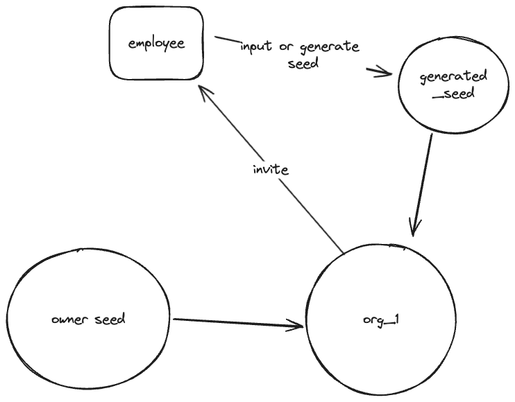
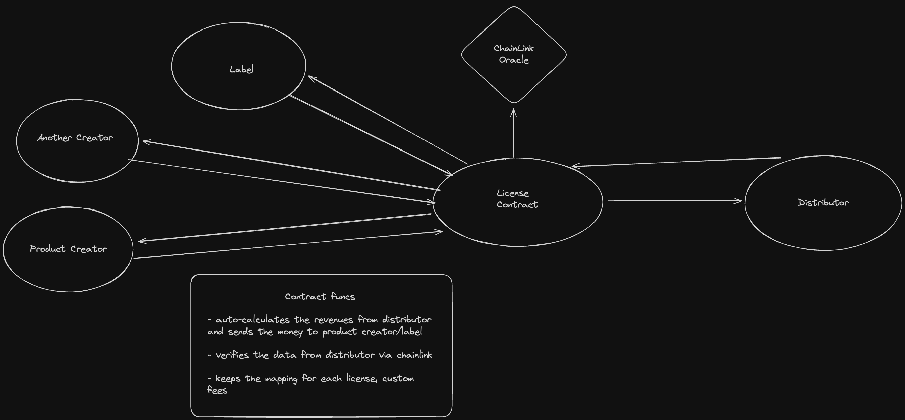
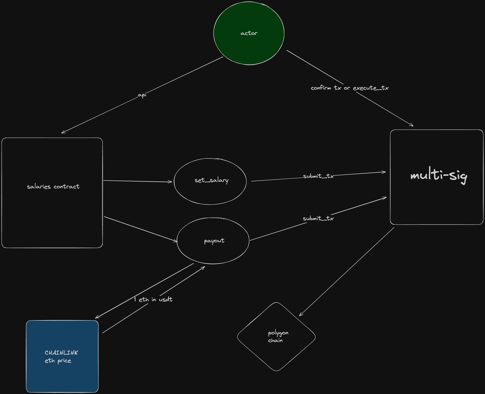

[//]: # (![Example architecture]&#40;./arch.png "Arch"&#41;)

# Registration Flow

- On First Login - Owner inputs his SEED_KEY (mnemonic), creates an organization, we save its seed hash for future login and signing internal txs.
- When inviting an employee to organization- we generate an invitation link, then after clicking on this link - the user is asked for seed, if he's already registered or able to generate a seed for new account.
-
